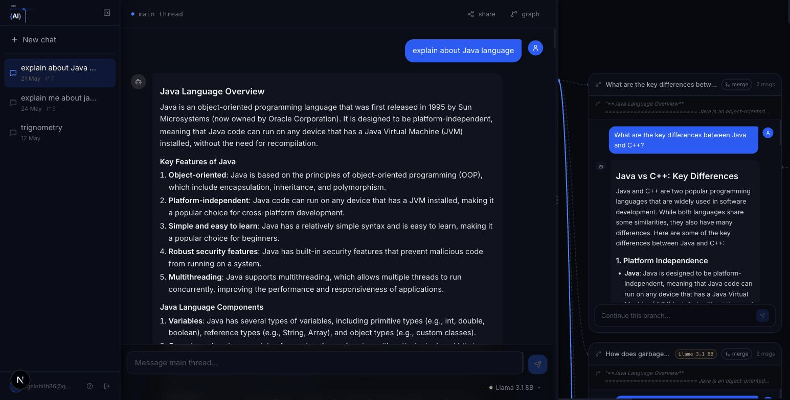
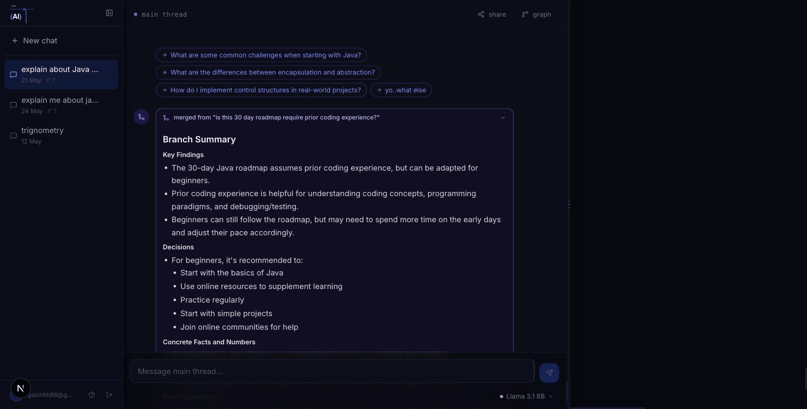
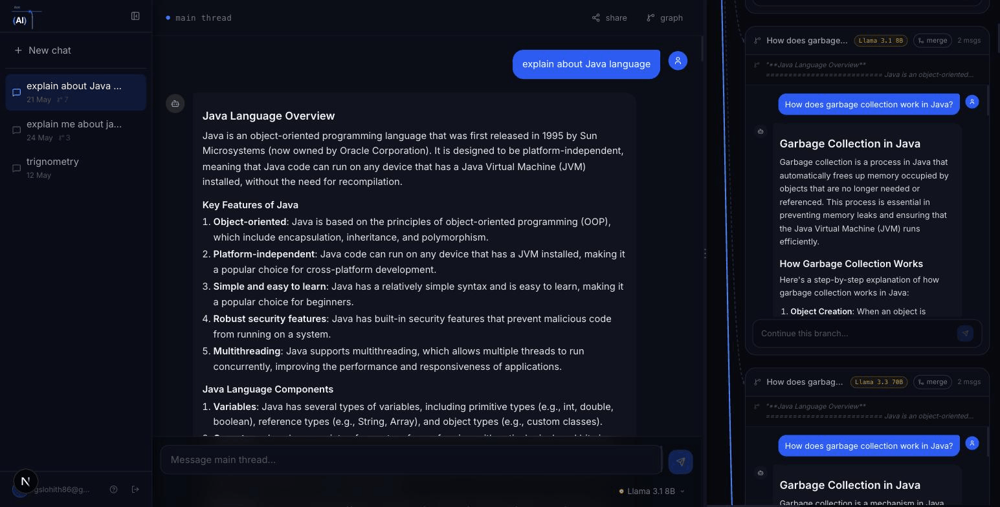
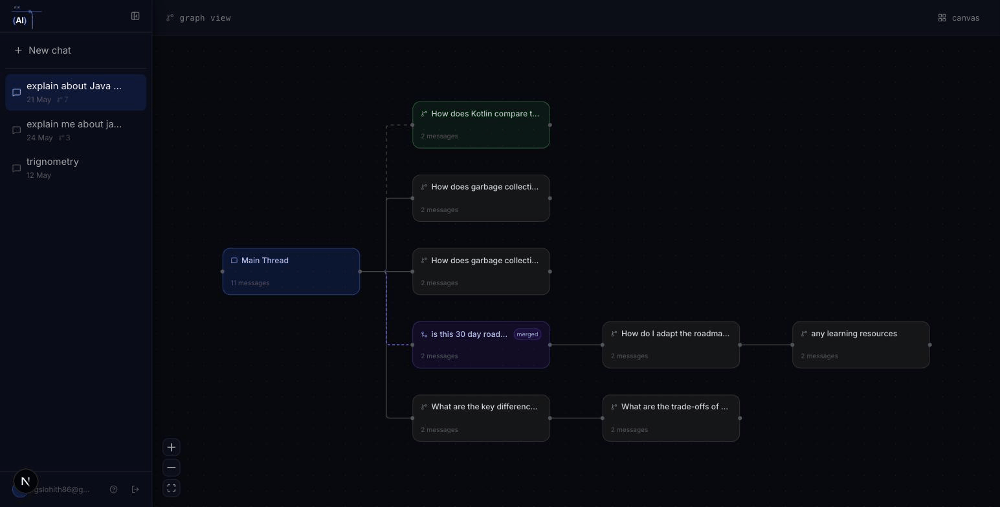
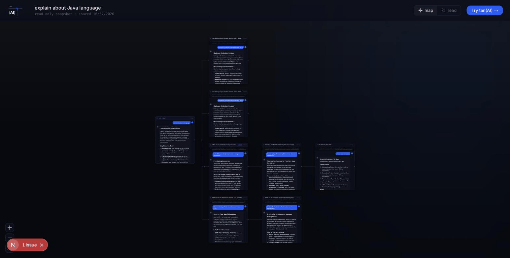

<div align="center">

# tan(AI)

**Branching AI conversations on a visual canvas.**
Because the best conversations go off on tangents.

[How it works](#how-it-works) · [Features](#features) · [Try it](#try-it) · [Tech](#under-the-hood) · [Run locally](#run-locally)


</div>

---

## Why

Every AI chat is a single straight line. Ask a follow-up and your main topic gets buried. Want to explore two ideas? You pollute one thread or juggle multiple tabs, and the AI in each one forgets the others exist.

tan(AI) treats a conversation like a tree instead of a line. Branch off any response, explore side questions in parallel, compare models against each other, then merge what you learned back into the main thread. The whole thing lives on a visual canvas so you can actually see your thinking.

## Features

### Branch from any response

Click any AI message and fork the conversation. The branch inherits context from its parent, shows up as a card connected to the exact message it forked from, and keeps the main thread clean. Branch from branches as deep as you want. The AI also suggests follow-up checkpoints under each reply, one tap to explore.



### Merge insights back

This is the part other branching tools skip: branches are not dead ends. Hit merge and the AI distills the branch into a compact synthesis (findings, decisions, concrete facts) and injects it into the parent thread as context. Your main conversation genuinely learns from the tangent. If the branch grows later, re-merge refreshes the synthesis in place.



### Compare models side by side

Ask the same question to two models at once. Compare mode creates sibling branches at the same fork point, each pinned to its model (Groq, OpenAI, Anthropic) for every follow-up. Watch Llama and GPT-4o disagree in real time.



### See your whole thinking as a graph

Switch to graph view for a bird's-eye map of every thread: main thread in blue, active branch in green, merged branches in violet with dashed edges. Click any node to jump to it on the canvas.



### Share it as a public mind map

One click publishes a read-only snapshot with an unguessable link. Viewers get the interactive map with zoomable, scrollable chat cards. No account needed, and your live conversation stays private.



### Context that manages itself

Long threads compress automatically: older messages get distilled into a rolling structured summary (goal, key facts, decisions, open questions) while recent messages stay verbatim. Branches inherit a frozen snapshot of their parent's context, so they never leak "future" messages from after the fork. A subtle divider in the thread shows exactly what the AI remembers. Context limit warnings adapt to the active model's real window.

## Try it

- **Trial mode**: sign up and start immediately, no API key needed. 3 chats with 5 branches each.
- **Bring your own key**: add a key from Groq (free), OpenAI, or Anthropic in the profile page and all limits disappear.

There is also a built-in illustrated guide at `/how-to`.

## How it works

1. Chat on the main thread
2. Click any AI response to branch (or tap a suggested checkpoint)
3. Explore branches side by side on the canvas
4. Compare two models on the same question
5. Merge the good stuff back into the main thread
6. Switch to graph view to see the whole tree
7. Share the map with anyone

## Under the hood

| Area | How |
|---|---|
| Framework | Next.js 16 (App Router), React, TypeScript, Tailwind |
| State | Zustand store with optimistic updates, Supabase (Postgres + Auth + RLS) for persistence |
| Streaming | Server routes stream from Groq / OpenAI / Anthropic SDKs with per-thread model pinning |
| Context engine | Rolling summarization with token-based triggers, message-ID anchoring (delete-safe), optimistic-lock writes against concurrent runs, frozen context snapshots at branch creation |
| Merge engine | LLM synthesis of branch transcripts, staleness detection via covered-message counts, in-place re-merge |
| Graph | ReactFlow + dagre auto-layout, custom nodes (read-only chat-card nodes on the share page) |
| Sharing | Frozen JSONB snapshots in a public-read RLS table, unguessable UUID links |
| Guide | Illustrated how-to page with inline SVG mockups, zero screenshot maintenance |

Some engineering details worth a look:

- **Branch context assembly** ([components/BranchCard.tsx](components/BranchCard.tsx)): each branch builds its prompt from a frozen parent summary snapshot, the verbatim gap between that snapshot and the fork point (bounded by the summarization invariant, no context holes), short tails from higher ancestors, and its own messages.
- **Server-authoritative summarization** ([app/api/summarize/route.ts](app/api/summarize/route.ts)): the client only fires a trigger; the server re-checks thresholds, distills, and commits with an optimistic lock so concurrent runs cannot clobber each other.
- **Merge messages without schema changes** ([lib/merge.ts](lib/merge.ts)): merge cards are regular messages carrying a structured metadata line, parsed for rendering and rewritten into clean framing before being sent to any model.

## Run locally

```bash
git clone <repo-url>
cd tan-ai
npm install
cp .env.local.example .env.local   # fill in the values below
npm run dev
```

`.env.local`:

```
NEXT_PUBLIC_SUPABASE_URL=...            # your Supabase project
NEXT_PUBLIC_SUPABASE_PUBLISHABLE_KEY=...
TRIAL_GROQ_API_KEY=gsk_...              # server-side key powering trial mode
```

Then run the SQL files in [supabase/migrations/](supabase/migrations/) in the Supabase SQL editor (they are idempotent and safe to re-run).

## Roadmap

- Local-only key storage (keys never touch the database, sent per request)
- Unshare button and share management
- Mobile-friendly read mode for shared links
- Per-branch context inspector (see exactly what the AI receives)

## Built by

**Lohith Gs**, Full Stack Developer
[LinkedIn](https://www.linkedin.com/in/LohithGs/) · [GitHub](https://github.com/lohith-gs)

Also built: [Git City](https://gitcity-3d.vercel.app/) · [DevLens](https://chromewebstore.google.com/detail/allolniimedofhingkeodfglnogcmelj)
